<div align="center">

# 📝 Student Portal

### Automated OMR Examination Portal

**Digitizing the entire university exam lifecycle — from question paper to published results.**

[](https://react.dev/)
[](https://fastapi.tiangolo.com/)
[](https://www.postgresql.org/)
[](https://www.python.org/)


</div>

---

## 📖 What is Student Portal?

Student Portal replaces manual, paper-based examinations with a fully digital pipeline. Faculty configure and upload exams, admins approve and trigger grading, and students take exams through a live split-screen OMR interface — with results and detailed answer-by-answer analytics generated automatically, in seconds instead of days.

Three role-based portals, one shared backend:

| Role           | What they do                                            |
| -------------- | ------------------------------------------------------- |
| 🎓 **Faculty** | Draft exams, upload question papers, submit answer keys |
| 🛡️ **Admin**   | Approve exams, trigger the auto-evaluation engine       |
| 👨‍🎓 **Student** | Wait, attempt, submit, and review results in real time  |

---

## 🔄 How It Works

```mermaid
flowchart LR
    A[Faculty uploads<br/>question paper + config] --> B[Admin reviews<br/>& approves exam]
    B --> C[Students notified<br/>& enter waiting room]
    C --> D[Live split-screen<br/>exam: PDF + OMR sheet]
    D --> E[Answers auto-submitted<br/>on timer or manual submit]
    E --> F[Faculty uploads<br/>answer key Excel]
    F --> G[Admin triggers<br/>one-click evaluation]
    G --> H[Students view<br/>results & comparison]
```



---

## ✨ Feature Highlights

### 🎓 Faculty Portal

- Upload official question paper PDFs with exam date, start time, and duration
- Set an exact `total_questions` value — the student OMR sheet auto-scales to match
- Upload the official answer key as a simple Excel (`.xlsx`) sheet after the exam concludes

### 🛡️ Admin Portal

- Review and approve exam submissions before they go live to students
- One-click evaluation engine — cross-checks every student's answers against the uploaded key instantly

### 👨‍🎓 Student Portal

- Real-time waiting room with a secure countdown that unlocks exactly at exam start time
- Split-screen exam view: scrollable question paper PDF on the left, interactive digital OMR sheet on the right
- Answers auto-lock and submit on timer expiry or manual submission
- Post-result analytics: side-by-side comparison of your answers vs. the official key, with ✔️ / ❌ markers and a total score summary

---

## 🛠️ Tech Stack

<div align="center">

| Layer        | Technology                                                                                                                                                |
| ------------ | --------------------------------------------------------------------------------------------------------------------------------------------------------- |
| **Frontend** | [React.js](https://react.dev/) · [React Router DOM](https://reactrouter.com/) · [Axios](https://axios-http.com/) · CSS3                                   |
| **Backend**  | [Python](https://www.python.org/) · [FastAPI](https://fastapi.tiangolo.com/) · [Uvicorn](https://www.uvicorn.org/) · [Pandas](https://pandas.pydata.org/) |
| **Database** | [PostgreSQL](https://www.postgresql.org/)                                                                                                                 |

</div>

---

## 📁 Project Structure

```text
STUDENT_PORTAL/
│
├── FRONTEND/
│   ├── package.json
│   ├── vite.config.js
│   ├── index.html
│   ├── public/
│   └── src/
│       ├── App.jsx
│       ├── main.jsx
│       ├── App.css
│       ├── index.css
│       └── components/
│           ├── Admin/                     # Admin dashboard, approvals, results posting
│           ├── Basic_interface/           # Landing / role-selection screen
│           ├── Faculty/                   # Exam creation & answer key upload
│           ├── Student_logins/            # Student authentication
│           └── Student_main_interface/    # Join exam, OMR portal, performance view
│
└── BACKEND/
    ├── main.py            # All API routes + OMR evaluation logic (FastAPI)
    ├── uploaded_exams/    # Stored question paper PDFs
    └── uploaded_keys/     # Stored answer key Excel sheets
```

> 📌 The entire backend currently lives in a single `main.py` file covering auth, exam management, file uploads, and the grading engine.

---

## ⚙️ Getting Started

Anyone can clone this repo and get it running locally in a few steps.

### Prerequisites

- **Node.js** (v18+) and npm
- **Python** 3.10+
- **PostgreSQL** running locally (with two databases: `STUDENTS` and `ADMIN`)

### 1️⃣ Clone the repo

```bash
git clone https://github.com/sairambairisetty/STUDENT_PORTAL.git
cd STUDENT_PORTAL
```

### 2️⃣ Backend setup

```bash
cd BACKEND
python -m venv venv
source venv/bin/activate        # Windows: venv\Scripts\activate
pip install fastapi uvicorn psycopg2-binary pandas python-multipart openpyxl python-dotenv
```

Create a `BACKEND/.env` file (never commit this — it's already in `.gitignore`):

```env
DB_NAME=STUDENTS
ADMIN_DB_NAME=ADMIN
DB_USER=postgres
DB_PASSWORD=your_local_postgres_password
DB_HOST=localhost
DB_PORT=5432
```

Run the server:

```bash
uvicorn main:app --reload
```

The API will be live at `http://localhost:8000`.

### 3️⃣ Frontend setup

```bash
cd FRONTEND
npm install
npm run dev
```

The app will be live at `http://localhost:5173`.

### 4️⃣ Database setup

Create the `STUDENTS` and `ADMIN` PostgreSQL databases locally, matching the table names referenced in `BACKEND/main.py` (`exam_sheets`, `exam_eligible_students`, `student_responses`, `student_results`, `Student_Logins`, `admin_logins`, `faculty_logins`, `faculty_info`, plus one table per branch for student records).

---

## 🔒 Security Note

Database credentials must always be loaded from environment variables (`.env`), never hardcoded in `main.py`. Make sure `.env` is listed in `.gitignore` before pushing any changes.

---

## 📌 Roadmap

- [ ] Faculty analytics dashboard with class-wide performance trends
- [ ] Email/SMS notifications for exam scheduling
- [ ] Multi-attempt practice test mode
- [ ] Mobile-responsive OMR interface
- [ ] Move backend routes out of a single `main.py` into modular routers

---

## 🤝 Contributing

Contributions, issues, and feature requests are welcome — feel free to fork the repo and open a pull request.

---

## 📄 License

Licensed under the MIT License.

---

<div align="center">
Built with ❤️ for a smarter, paperless exam system — Student Portal.
</div>
